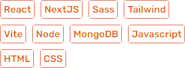

  
  <h1 align="center">Hiya, Ian here!</h1>
  
Frontend Web Developer

  

 

Story time! - I've learned how to code back when I was 13, customizing my Friendster profile with HTML & CSS. I took up Computer Science back in college, got introduced to C and Java but as far as web-dev is concerned, most of the learnings were on my own- you know how it is. It is through self-learning that I got to know how to use the modern technologies in web development.

 

<h2>I'm good at:</h2>

 

🔭 I’m currently working on my portfolio as well as some frontend exercises/challenges

💼 I’m open for freelance work/tutoring.

🌱 I’m currently learning different APIs, CMS, backends

💬 Ask me about anything web-dev related.

<!--
**ianbuen/ianbuen** is a ✨ _special_ ✨ repository because its `README.md` (this file) appears on your GitHub profile.

Here are some ideas to get you started:

- 🔭 I’m currently working on ...
- 🌱 I’m currently learning ...
- 👯 I’m looking to collaborate on ...
- 🤔 I’m looking for help with ...
- 💬 Ask me about ...
- 📫 How to reach me: ...
- 😄 Pronouns: ...
- ⚡ Fun fact: ...
-->
